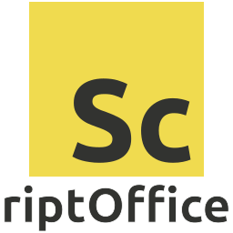

_scriptOffice for JavaScript_

<div align="center">
  
</div>

a library to create files of an office software suite like [LibreOffice](https://www.libreoffice.org/) programmcity and automated

# Using

## NPM / YARN / PNPM
currently not available

## CDN
currently not available

## Build with webpack

cloning git repo and install dependencies
```
$ git clone https://gitlab.com/Captainpast/scriptoffice.js
$ cd scriptoffice.js
$ npm install
```

run `dist` script to create a minified and compact version
```
$ npm run dist
```
The release is now in the `./dist` folder and can be imported.

```js
import { OfficeDocument } from "./dist/script-office.min.js";
```
or
```html
<script src="./dist/script-office.min.js"></script>
```

# Documentation

## Spreadsheet

### creating a new document

```js
var doc = OfficeDocument.create({ type: "spreadsheet" });
// or
var doc = OfficeDocument.create("spreadsheet");

// get the active and only sheet of the document
var sheet = doc.activeSheet;
```

### importing an existing document
currently not supported

### working with sheets
a spreadsheet can have multiple sheets
``` js
// get the current and active sheet
var sheet = doc.activeSheet;

// create sheet
var sheet = doc.addSheet("first");

// get sheet by index
var sheet = doc.getSheet(1);
// get sheet by name 
var sheet = doc.getSheet("first");

// set title
sheet.title = "first";
```

### working with cells
```js
// get cell
var cell = sheet.getCell("A1")
var cell = sheet.getCell({ col: "A", row: 1 })
var cell = sheet.getCell({ col: 1, row: 1 })

// set value
cell.value = "test";
cell.value = 2000;
cell.value = new Date();

// change style
cell.style.bold = true;
cell.style.italic = true;
cell.style.underline = "solid";
cell.style.underlineColor = "#000000";
cell.style.color = "#ffffff";
cell.style.columnWidth = 20;
cell.style.rowHeight = 10;
```

### specials
``` js
sheet.freezeAt("A1")
sheet.autoFilter("A1", "K9")
```

# Roadmap
- csv export
- xlsx export
- html export
- HTML color code names
- imports
- texts, drawings, presentations